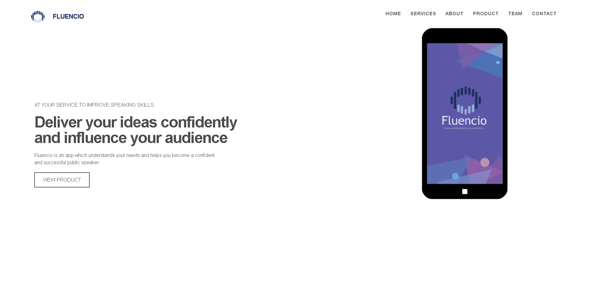

# Fluencio Responsive Website

Welcome to the Fluencio Responsive Website repository! This website includes CSS animations, parallax effects, a carousel, and a sticky navigation bar.

## Overview

Fluencio is a responsive website designed to showcase various modern web development techniques. The site features animations, a parallax effect, a carousel, and a sticky navigation bar, making it a great example of a dynamic and engaging web experience.

## Screenshots

Here’s a screenshot of the homepage:

## Features

- **CSS Animations**: Smooth and engaging animations powered by Animate.css.
- **Parallax Effect**: A visually appealing parallax effect that enhances the user experience.
- **Carousel**: A responsive carousel slider created using Owl Carousel 2.
- **Sticky Navigation Bar**: A navigation bar that stays fixed as the user scrolls.

## Getting Started & Executing

You can start by downloading this repository on your local machine, unzipping the file, and opening "index.html" with a browser.

### Prerequisites

A modern web browser like Safari, Chrome, Microsoft Edge, Mozilla Firefox, etc.

## Built With

- **HTML5**: Fifth version of HTML.
- **CSS3**: CSS3 is a style sheet language.
- **Bootstrap 3.3**: HTML, CSS, and JS framework for developing responsive, mobile-first webpages.
- **JavaScript**: High-level, interpreted programming language.
- **jQuery**: A fast, small, and feature-rich JavaScript library.
- **Animate.css**: A cross-browser library of CSS animations.
- **WOW.js**: Reveal CSS animation upon page scroll.
- **Magnific-popup.js**: Plugin that enables popup of elements in a single container.
- **Owl Carousel 2.js**: jQuery plugin to create responsive carousel slider.
- **CounterUp.js**: jQuery plugin to count up to a targeted number when visible.
- **Waypoints**: To trigger a function upon scroll.

## Contributing

We welcome contributions from the community! If you’d like to contribute to the project, please follow these steps:

1. Fork the repository.
2. Create a new branch (`git checkout -b feature/your-feature-name`).
3. Make your changes.
4. Commit your changes (`git commit -m 'Add some feature'`).
5. Push to the branch (`git push origin feature/your-feature-name`).
6. Open a pull request.

Thank you for visiting the Fluencio Responsive Website repository! We hope you find it useful and inspiring.
